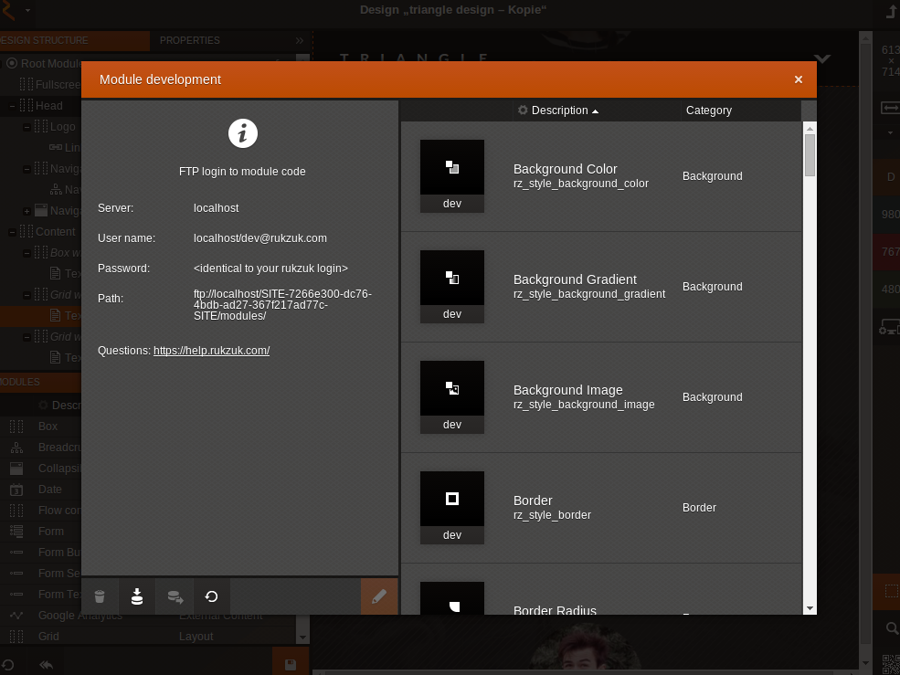

Tutorials
---------------

.. _your-first-module:

#################
Your First Module
#################

#. Find an unique ID for your module. Preferably prefix your module ID with a vendor name of your choice (e.g. mycompany\_) to avoid name conflicts.

   .. note::

       You can override all default rukzuk modules (vendor prefix "rz\_") if you name your new customized module with the origin module ID. When you remove your derived module, the original module will come into play again.

#. Create a module directory following this :doc:`recommendation <getting_started>`.
#. Start with a simple module:

   .. code-block:: php
        :linenos:

        <?php
        namespace Rukzuk\Modules;
        class mycompany_textfield extends SimpleModule
        {
          /**
           * @param $renderApi
           * @param \Render\Unit $unit
           * @param \Render\ModuleInfo $moduleInfo
           */
           public function renderContent($renderApi, $unit, $moduleInfo)
           {
               echo "
My Text
";
               $renderApi->renderChildren($unit);
           }
        }
        ?>
#. Now upload the module into your rukzuk space as :ref:`mentioned below <upload-via-ftp>`.
#. Refresh the module repository by clicking the refresh button in the "Module Development" pop-up.
#. Test your new module.

:ref:`Download Module Example <_static/downloads/mycompany_textfield.zip>`

###############
Advanced Module
###############

#. Follow the steps 1, 2 and 3 from the :ref:`above instruction <your-first-module>` to prepare for the advanced module development.
#. Now we are going to include JavaScript functionality to your new module. In the example below, we utilize the jQuery library.

   .. code-block:: javascript
        :linenos:

        define(['jquery'], function ($) {
            return {
                init: function () {
                    var mycompany = function(element){
                        var elementId = $(element).prop('id');
                        alert(elementId);
                    };

                    $('.mycompany_textfield').on('click', function(){
                        $(this).addClass('mycompany_class');
                        mycompany(this);
                    });
                };
            };
        });

   You might ask yourself what the "define" stuff does. rukzuk is loading module JavaScript files on demand or dynamically as they are being called when a module is used. To achieve such behavior, rukzuk takes advantage of a third party JavaScript library called `require.js <http://requirejs.org/>`_.
#. In your ``custom.json`` you need to include the above JavaScript file:

   .. code-block:: json

        {
            "assets":{
                "js":[
                    {
                        "file":"mycompany.js",
                        "type":"module",
                        "mode":"live"
                    }
                ]
            }
        }

.. _module-user-interface:

#####################
Module User Interface
#####################

The below screen-shot illustrates the user interface of the "rz_anchor" module in edit mode.

.. image:: _static/images/rz_anchor_edit_panel.png

These edit mode forms also represent the unit data and can be created straight forward with the built-in module user interface builder. It allows you to add multiple tabs containing form fields, e.g. text input, number slider or image chooser.

   .. note::

       Keep in mind that page editing rights are defined on tab-level after inserting the module into a design. Therefore, it is recommended to group form fields into tabs according to their right specific context.

#. Follow the steps 1, 2 and 3 from the :ref:`above instruction <your-first-module>`.
#. Open "Module Development" in the main menu of your rukzuk space
#. Double-click on a module to edit
#. Switch to the "User Interface" tab

The **Variable name** must be unique in a module and will be used to access the value of each form field later on.

   .. note::

       Some form fields offer the possibility for responsive values. If enabled, a single form field can hold multiple values, one for each screen resolution of the website.

The form configuration will be saved in the file ``form.json``.

################
Access Unit Data
################

==================================
In PHP ``mycompany_textfield.php``
==================================

.. code-block:: php
    :linenos:

    <?php
    namespace Rukzuk\Modules;
    class mycompany_textfield extends SimpleModule
    {
      /**
       * @param $renderApi
       * @param \Render\Unit $unit
       * @param \Render\ModuleInfo $moduleInfo
       */
       public function renderContent($renderApi, $unit, $moduleInfo)
       {
           $anchorName = $renderApi->getFormValue( $unit, 'anchorName' );
           echo "
{$anchorName}
";
           $renderApi->renderChildren($unit);
       }
    }
    ?>

All declared unit data (see :ref:`Module User Interface <module-user-interface>`) can be accessed by the following code fragment for example:

.. code-block:: php

    $renderApi->getFormValue( $unit, 'anchorName' );

.. note::

    The module can access unit information or data in edit mode as well as in an live environment.

=============================
In JavaScript ``editMode.js``
=============================

.. TODO show example with extended JsModule?

.. code-block:: javascript
    :linenos:

    define(['jquery', 'CMS'], function ($, CMS) {
        return {
            init: function () {
                $('.mycompany_textfield').on('click', function(){
                    var unitId     = $(this).attr('id');
                    var anchorName = CMS.get(unitId).formValues.anchorName.value
                });
            };
        };
    });

All declared unit data (see module "edit mode" editor) can be accessed by the following code fragment for example:

.. code-block:: javascript

    CMS.get(unitId).formValues.anchorName.value

.. note::

    The ``CMS`` API is globally available throughout the rukzuk web application while in edit mode. That means the custom module will not be able to consume information or data from the ``CMS`` API in an live environment (e.g. live hosting).

################################
Listening to Events in Edit Mode
################################

In case you want to react on user events, e.g. do something after the user changed a form value or after the user selected your module, you can do so by extending the ``JsModule`` of the default "rz_root" module. Your ``editMode.js`` could look like:

.. code-block:: javascript
    :linenos:

    define(['jquery', 'CMS', 'rz_root/notlive/js/baseJsModule'], function ($, CMS, JsModule) {
        return JsModule.extend({
            // alert when the user changed the form field 'anchorName'
            onFormValueChange: function (cfg) {
                if (cfg.key === 'anchorName') {
                    alert(cfg.unitId);
                }
            },

            // alert when the user selects your module
            onUnitSelect: function (cfg) {
                alert(cfg.unitId);
            }
        });
    });

Please have a look at the :doc:`JS Module API <js_module_api>` for all available events.

.. TODO add example; explain differences between live and edit mode, e.g. JsModule not available

.. note::
    Instead of a complete page reload only the DOM nodes of a module get replaced when the user changes the form values in edit mode. So you have to re-attach listeners on DOM elements on the ``afterRenderUnit`` event. If you set your listeners in the ``initUnit`` method, the ``JsModule`` helper takes care about that.

######################
Dynamic CSS Generation
######################

The default "rz_root" module comes with a handy helper for dynamic CSS generation. Based on the form values in the unit data CSS code will be generated.
All dynamic CSS logic of a module is handled in the file ``css.js`` and is based on the third party JavaScript library `AbsurdJS <http://absurdjs.com/>`_.

Our ``DynCSS`` helper takes care about responsive values and media queries as well as selector nesting according to the structure tree: all CSS styles defined in a module can only apply to the module itself and subordinate modules.
It also provides a little API e.g. for resolving colors or image URLs.

.. code-block:: javascript
    :linenos:

    DynCSS.defineModule('rz_anchor', function (api, v, context) {
        return {
            // this gets applied to the module itself
            color: api.getColorById(v.cssBackgroundColor),

            // these styles are for child elements with the class "anchor"
            '& > .anchor': {
                textAlign: v.cssVisualHelperValign,
                backgroundImage: 'url(' + api.getImageUrl(v.cssBackgroundImage, v.cssBackgroundImageSize) + ')'
            }
        };
    });

.. note::

    The variable name of form fields which should trigger CSS re-generation must begin with "css".

Please refer to the `AbsurdJS documentation <http://absurdjs.com/pages/css-preprocessing/basics/>`_ for further syntax details.

.. _upload-via-ftp:

##########################
Upload Your Module via FTP
##########################

You can directly upload your module through FTP. The FTP connection details can be found in the "Module Development" pop-up in your rukzuk space.

#############################
Export and Import Your Module
#############################

To easily use your module in other websites or rukzuk spaces you can use the export and import facility in the "Module Development" pop-up.

